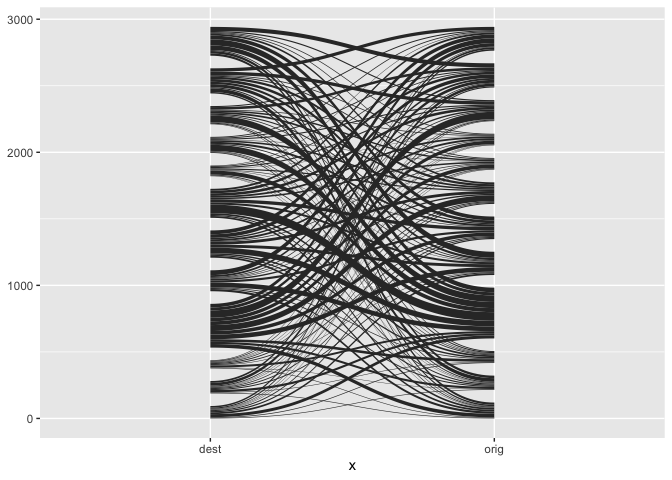
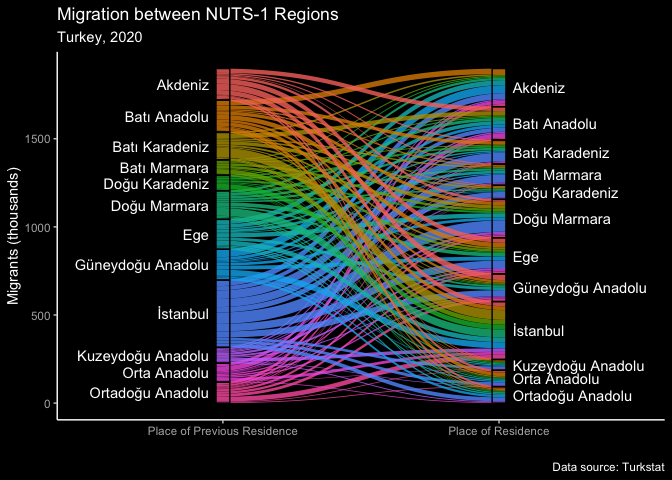

Migration
================

``` r
mig_tr_ibbs2 <- read_delim(here("data/tr/mig_tr_ibbs2.csv"), delim = "|", skip = 2)

mig_tr_ibbs2_2 <- mig_tr_ibbs2 %>% 
  rename(year = X1, orig = X2) %>% 
  filter(!is.na(orig)) %>% 
  fill(year) %>% 
  select(-X15) %>% 
  pivot_longer(-c(year, orig), names_to = "dest", values_to = "flow") %>% 
  separate(orig, into = c("orig", "orig_code"), sep = "-") %>% 
  separate(dest, into = c("del", "dest"), sep = ":") %>% 
  mutate(flow = ifelse(is.na(flow), 0, flow)) %>% 
  select(-c(orig_code, del))
```

# Visualization - bilateral

``` r
s <- mig_tr_ibbs2_2 %>%
  mutate(flow = flow / 1000) %>% 
  filter(year == 2020) %>% 
  select(orig, dest, flow) %>%
  gather_set_data(x = 1:2)

s %>% 
  ggplot(aes(x = x, id = id, value = flow, split = y)) +
  geom_parallel_sets()
```

<!-- -->

``` r
s <- s %>% 
  mutate(x = fct_rev(x))
levels(s$x)
```

    ## [1] "orig" "dest"

``` r
p <- s %>%
  distinct(x, y) %>%
  mutate(h = as.numeric(x == "orig"),
         n = h * -0.1 + 0.05)

s %>% 
  ggplot(aes(x = x, id = id, value = flow, split = y)) +
  geom_parallel_sets(aes(fill = orig), alpha = 0.8, axis.width = -0.05, sep = 0) +
  geom_parallel_sets_axes(fill = "transparent", colour = "black", 
                          axis.width = 0.05, sep = 0) +
  guides(fill = "none") +
  geom_parallel_sets_labels(angle = 0, hjust = p$h,
                            position = position_nudge(x = p$n),
                            sep = 0) +
  scale_x_discrete(labels = c(orig = "Place of Previous Residence",
  dest = "Place of Residence")) +
  labs(y = "Migrants (thousands)", x = "",
       title = "Migration between NUTS-1 Regions",
              subtitle = "Turkey, 2020",
              caption = "Data source: Turkstat") +
  dark_theme_classic() 
```

<!-- -->
